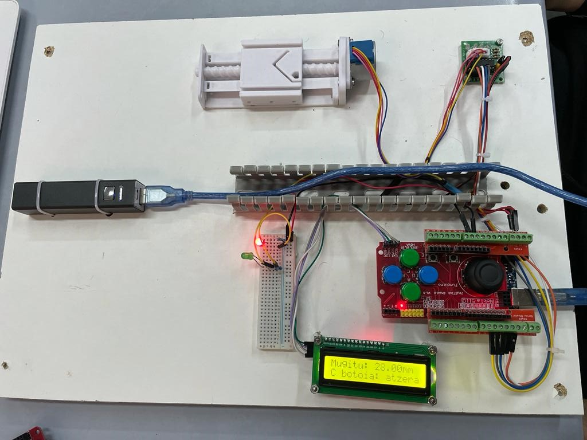

# Luneta
# Elementuak

- Arduino UNO
- JoyStick Shiled 
- Pasos pausoko motorra (28BYJ-48)
- 2 Led
- 2 erresistentzia
- LCD
- Bateria mugikorra
- Protoboard-a

## Funtzionamendua

1. Bateriaren botoiari heman piztutzeko
2. Joystick-arekin mugitzea nahi duzun diztatzia jartzen duzu LCD pantailan
3. C botoiari heman konfigurazio orritik ateratzeko (Konfigurazio orrira bueltatu nahi bada bateria itzali eta hasieratik hasi
4. D boiari heman eskerreran emateko edo B botoiari eskuinera mugitzeko
5. Bateriaren botoiari heman itzaltzalko

